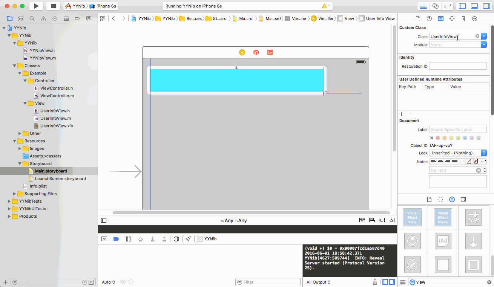
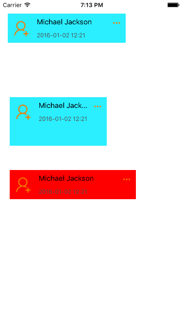

# YYNib
add xib into storyboard or xib

添加 xib 到 storyboard 或者添加到 xib





### How to use

`pod YYNib`

```
#import <UIKit/UIKit.h>
#import "YYNibView.h"

@interface UserInfoView : YYNibView

@end
```